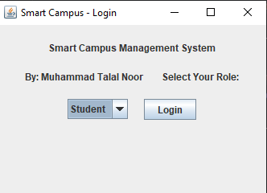
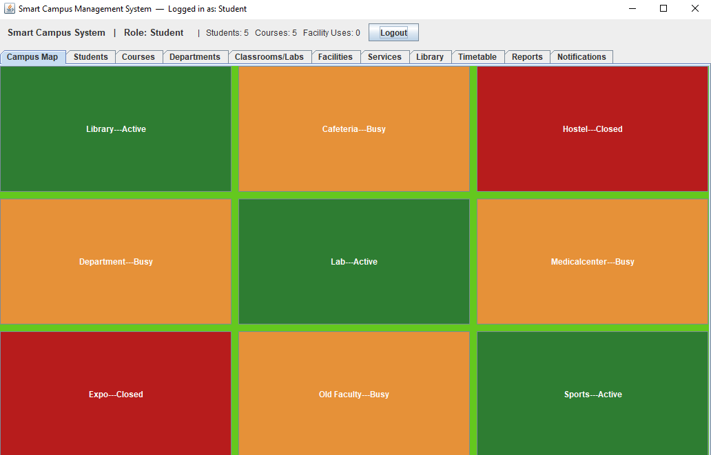
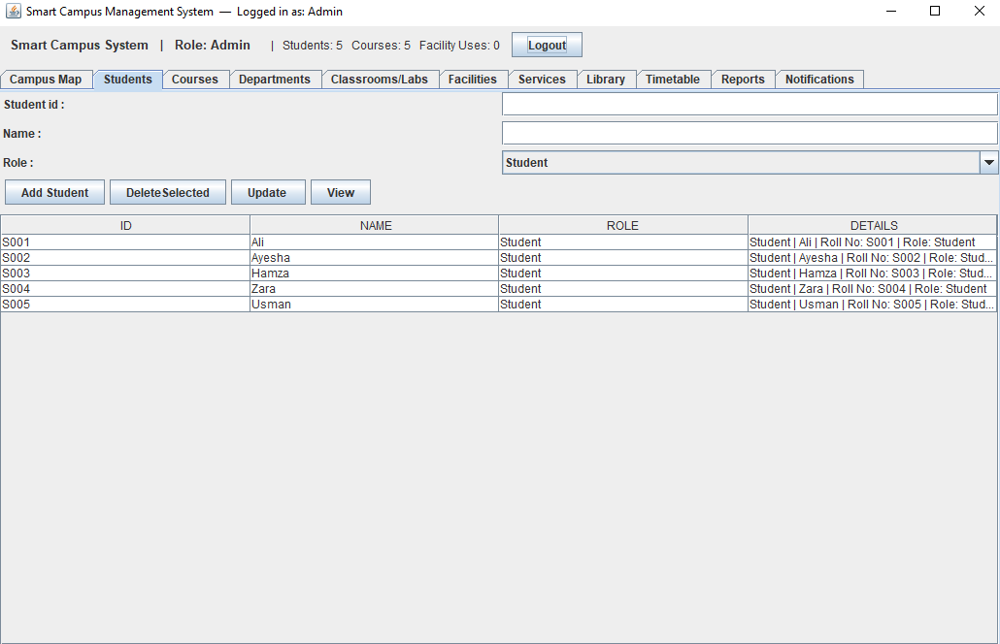
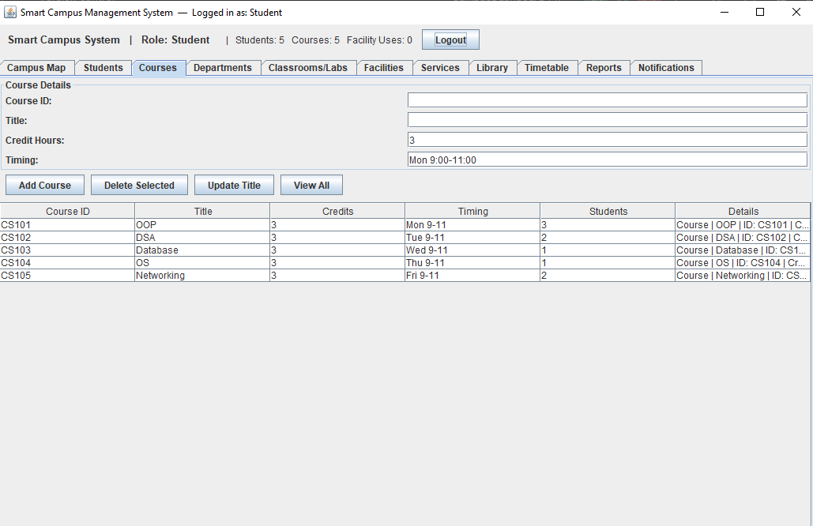

# Smart Campus Management System

## 📌 Description
This is a simple Campus Management System built using Java.  
It is part of my learning journey in Artificial Intelligence at COMSATS University Islamabad.

---

## 💡 Features
- Student dashboard interface
- Simple campus management system
- Basic navigation system
- Clean Java Swing GUI

---

## 🛠️ Technologies Used
- Java  
- Java Swing (GUI)

---
## 📸 Screenshots

### Login Page

### Dashboard

### Student Module

### Course Module

---

## 🚀 How to Run
1. Open project in any Java IDE (IntelliJ / Eclipse / NetBeans)
2. Compile Java files
3. Run the main class

---

## 👨‍💻 Author
Talal Noor
